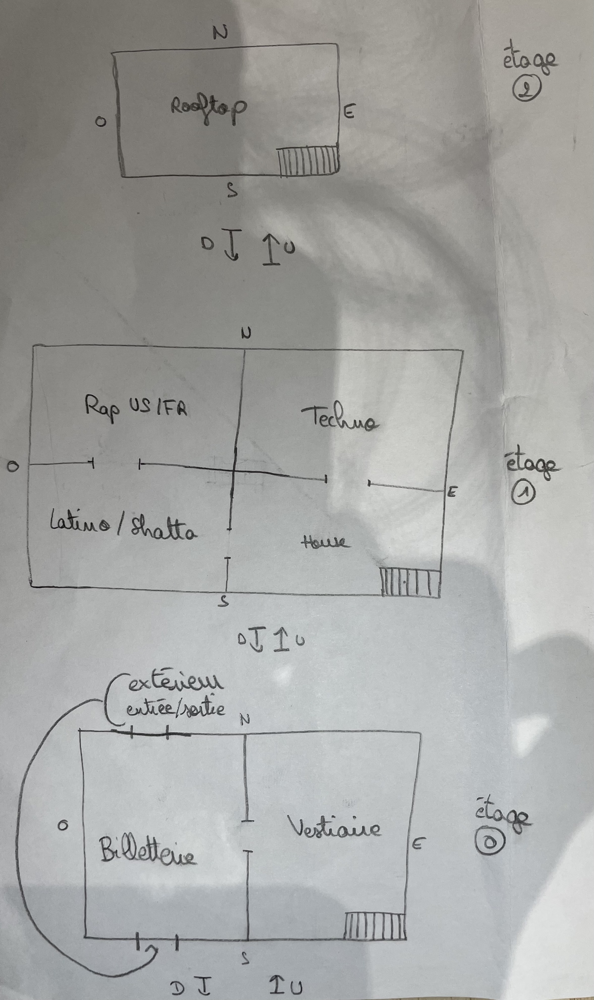

##### Jeu textuel en Python

**Projet : Anadélys x Rosa-Llucia**

------------------------------------------------------------------------

#### Guide utilisateur et dévelopeur

## L’Anarø CLUB — Jeu d’aventure textuel (CLI + GUI)

Bienvenue dans **L’Anarø CLUB**, un jeu d’aventure textuel en Python où tu dois survivre à une nuit en boîte, enchaîner les salles, parler aux PNJ, récupérer des objets… et tenter d’infiltrer la **Secret Room**.

------------------------------------------------------------------------

## Objectif du projet

Le but de ce projet est de créer un **jeu vidéo en mode texte** en
utilisant le langage **Python**.\
Le joueur interagit avec l'histoire à travers des choix écrits, qui
influencent son parcours, les quêtes qu'il peut accomplir et la fin du
jeu.

------------------------------------------------------------------------

## Univers du jeu

L'histoire se déroule dans une **boîte de nuit** animée, pleine de
musique, de lumières et de mystères.\
Le joueur peut se déplacer entre différentes salles, chacune ayant : -
une ambiance différente\
- des personnages spécifiques\
- des objets à trouver\
- des quêtes à accomplir

L'exploration est donc un élément central du jeu.

------------------------------------------------------------------------

## Contexte de l'histoire

Le joueur arrive dans une boîte de nuit pour passer une soirée normale,
mais très vite tout se complique. Des objets sont perdus, des personnes
ont besoin d'aide et certains endroits sont inaccessibles sans
conditions particulières.

Pour réussir sa nuit, le joueur devra : - explorer\
- parler aux personnages\
- résoudre des problèmes\
- accomplir des quêtes

Chaque quête réussie permet de gagner des **titres** ou des avantages
utiles pour la suite.

------------------------------------------------------------------------

## Système de quêtes

Le jeu repose sur : - une **quête principale**\
- plusieurs **quêtes secondaires**

Certaines quêtes débloquent des objets, des accès à des salles ou des
conditions nécessaires pour la fin du jeu.

------------------------------------------------------------------------

## Quête principale

### Objectif final (victoire)

**Survivre à cette nuit pleine de rebondissements et entrer dans la
salle VIP avant la fermeture de la boîte.**

### Conditions possibles pour gagner :

-   Avoir accumulé suffisamment de **titres**\
    **OU**
-   Avoir réussi la quête **Secret Room**

------------------------------------------------------------------------

## Quêtes secondaires

### Secret Room

Le caissier a perdu un **bracelet d'accès** à une salle secrète. Le
joueur doit le retrouver et se préparer correctement pour entrer.

### Sauver le manteau

Le joueur a perdu son **ticket de vestiaire** et doit le retrouver pour
récupérer son manteau.

### DJ Rosa

Rosa a perdu son **casque**. Le joueur doit le retrouver pour que la
musique puisse commencer.

### Cocktail Daniel

Le barman a besoin d'une nouvelle bouteille de **sirop magique**. Le
joueur doit la trouver pour obtenir un cocktail spécial.

### Retrouve Anadélys

Anadélys a disparu dans la boîte. Le joueur doit explorer, parler aux
personnages et suivre des indices pour la retrouver.

------------------------------------------------------------------------

## Mécaniques de jeu (programmation)

Le jeu utilise : - `input()` pour les choix\
- des variables pour stocker objets et quêtes\
- des conditions (`if/else`)\
- des boucles (`while`)

------------------------------------------------------------------------
## Diagramme de classes

------------------------------------------------------------------------

#### Améliorations possibles

Pour améliorer notre jeu, nous aurions pu : 
- Ajouter des classes afin de séparer les différentes méthodes
- Ajouter plus de quêtes pour rajouter du challenge
- Améliorer l'interface graphique pour qu'elle soit plus ludique
- Simplifier le code au maximum afin d'en diminuer sa complexité en temps

------------------------------------------------------------------------

## Conclusion

Ce projet combine narration, logique de programmation et interaction
avec l'utilisateur.\
Il permet de créer un **jeu immersif en mode texte** où chaque décision
influence la fin de la soirée.

